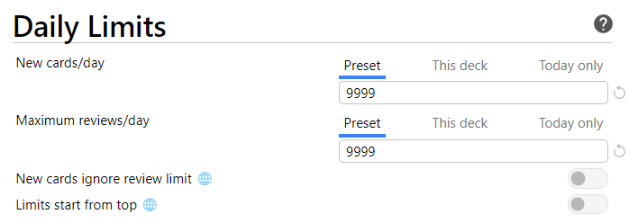
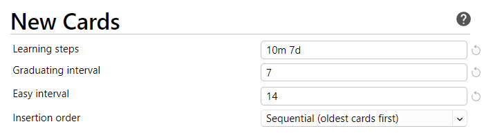
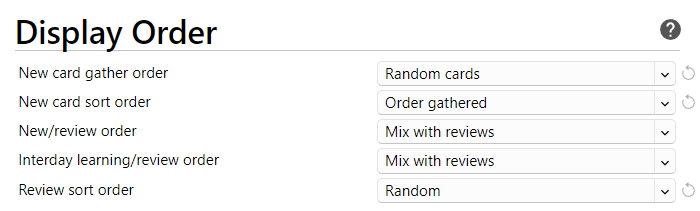
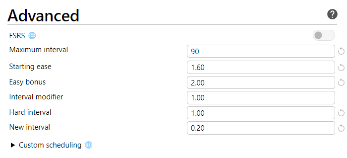

# Anki for non-memorization subjects

This is standard. 

Why '7-day' good interval

-	In problem solving subjects, you often implicitly review the concepts several times during assignments, projects, lecture, etc., so adding an additional reviews in Anki on top of that via shorter intervals (e.g., "10m 1d 3d") is a waste of time.
-	Increased interval lets you decide whether a note is worth keeping or deleting. Deleting bad notes will save you from review fatigue.
-	Selecting `Hard` during the learning phase will schedule it 4-days later. (In case you're afraid you will forget before 7-days). 

Advanced determines how notes are scheduled after they leave the "learning" stage. When you press `good` on a note, Anki sets intervals to the current interval times

Hard: `new_interval = curr_interval * hard_interval`
Good: `new_interval = curr_interval * ease_factor`
Easy: `new_interval = curr_interval * ease_factor * easy_bonus`
